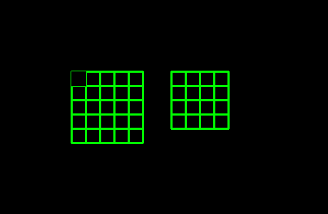

# halide调度过程可视化工具


### 简介

该工具主要是为了进行能够对Halide使用了trace之后，打印出来的计算信息进行动态图可视化，如此可以更好地理解Halide的调度过程

### 代码实现

下面部分显示了所有的代码实现

```python3

import cv2
import numpy as np
import imageio
# 显示Halide计算过程的图像可视化

def readtxt(filename:str):
    f = open(filename)
    line = f.readline()
    allline = []
    while line:
        allline.append(line)
        line = f.readline()
    f.close()
    return allline

# 分析文本，返回画图信息
def txt2struct(allline:list):
    #分割
    info = []
    for line in allline:
        if '(' in line and ')' in line:
            a = line.split('(')
            name =  a[0].split(' ')[-1]
            if ')' in a[-1]:
                b = a[-1].split(')')[0].split(',')
                point = [int(i.strip()) for i in b]
                # 添加进入info
                info.append({'name':name, 'point':point})
    return info

'''
{
maxtrix:[{name:str,size:[],begin:[]},]
timeline:
[{name:str,point:[,]},]
}
'''
def info2max(info:list):
    allinfo = {}
    allmaxtrix = []
    all_name = []
    for i in info:
        if i['name'] not in all_name:
            all_name.append(i['name'])
    for i in all_name:
        maxtrix = {}
        maxtrix['name'] = i
        maxtrix['size'] = [0,0]
        maxtrix['begin'] = [0,0]
        allp = []
        for j in info:
            if j['name'] == i:
                allp.append(j['point'])
        maxtrix['size'] = [max([k[0] for k in allp]), max([k[1] for k in allp])]
        maxtrix['begin'] = [min([k[0] for k in allp]), min([k[1] for k in allp])]
        k1 = maxtrix['size']
        k2 = maxtrix['begin']
        k2 = [min(0,k3) for k3 in k2]
        maxtrix['size'] = [k4-k5 + 1 for k4,k5 in zip(k1,k2)]
        allmaxtrix.append(maxtrix)
    allinfo['maxtrix'] = allmaxtrix
    allinfo['timeline'] = info
    return allinfo


'''
实际画图的操作
'''
#初始化图像
def initmax(info:dict, rect_size:list):
    nw = 5
    nh = 5
    zerop = []
    for i in info['maxtrix']:
        zerop.append([nw + i['begin'][0], nh + i['begin'][1]])
        nw += i['size'][0] + 2
    nw += 5
    nh += (5 + max([i['size'][1] for i in info['maxtrix']]))
    nw *= rect_size[0]
    nh *= rect_size[1]
    zerop = [[i[0]*rect_size[0], i[1]*rect_size[1]] for i in zerop]
    return np.zeros((nh,nw,3)).astype(np.uint8), zerop

#画矩阵
def plotmax(img:np.ndarray, begin:list, size:list, gap:list, linewidth:int, color:tuple):
    # 竖线
    for i in range(0, size[0] + 1):
        cv2.line(img,
                 (begin[0] + i * gap[0], begin[1]),
                 (begin[0] + i * gap[0], begin[1] + size[1]*gap[1]),
                 color,
                 linewidth)
    # 横线
    for i in range(0, size[1] + 1):
        cv2.line(img,
                 (begin[0], begin[1] + i * gap[1]),
                 (begin[0] + size[0] * gap[0], begin[1] + i * gap[1]),
                 color,
                 linewidth)

    return img

# 画框点
def PoltRect(img:np.ndarray, begin:list, size:list, color:tuple, time:int):
    res_img = []
    for i in range(time):
        b = img.copy()
        cv2.rectangle(b,
                      (begin[0] + size[0], begin[1] + size[1]),
                      (begin[0], begin[1]),
                      (0,0,0),
                      thickness=-1
                      )
        res_img.append(b)
        a = img.copy()
        cv2.rectangle(a,
                      (begin[0] + size[0], begin[1] + size[1]),
                      (begin[0], begin[1]),
                      color,
                      thickness=-1
                      )
        res_img.append(a)

    return res_img
        # color = [max(0, min(255, 255 - i)) for i in color]
        # color = tuple(color)

# 寻找对应的名字
def find_dict(allinfo:dict, name:str):
    for j in range(len(allinfo['maxtrix'])):
        i = allinfo['maxtrix'][j]
        if name == i['name']:
            return i, j
    return {'name':None, 'size':[], 'begin':[]}, 0

def frame_to_gif(frame_list, gifname:str):
    # BGR->RGB
    # for i in frame_list:
    #     cv2.cvtColor(i, cv2.COLOR_BGR2RGB)
    # for i in frame_list:
    #     cv2.cvtColor(i, cv2.COLOR_BGR2RGB)
	gif = imageio.mimsave(gifname, frame_list,'GIF')


import argparse

# 创建parser对象
parser = argparse.ArgumentParser(description="Show Halide Info")

# 添加参数
# help添加参数说明
parser.add_argument('--Halide', default='Halide.txt', type=str, help='Halide trace info')
parser.add_argument('--Gif', default='result.gif', type=str, help='Halide Gif Path')
# 解析并打印参数
args = parser.parse_args()

if __name__ == '__main__':
    allline = readtxt(args.Halide)
    txtinfo = txt2struct(allline)
    allinfo = info2max(txtinfo)
    gap = [20,20]
    img , zeros= initmax(allinfo, gap)
    # 画矩阵
    for i,j in zip(zeros, allinfo['maxtrix']):
        img = plotmax(img, i, j['size'], gap, 2, (0,255,0))
    # 画动态点
    show_img = []
    for p in allinfo['timeline']:
        maxinfo, pzp = find_dict(allinfo, p['name'])
        pzp = zeros[pzp]
        res_img = PoltRect(img,
                           [pzp[0] + p['point'][0] * gap[0], pzp[1] + p['point'][1] * gap[1]],
                           gap,
                           (0,0,255),
                           2)
        img = res_img[-1].copy()
        show_img.extend(res_img)
    # 显示动图
    for i in show_img:
        cv2.imshow("maxtrix", i)
        cv2.waitKey(33)

    # 保存为动图
    for i in show_img:
        cv2.cvtColor(i, cv2.COLOR_BGR2RGB, i)
    frame_to_gif(show_img, args.Gif)
    # print(allinfo)
    # for i in txtinfo:
    #     print("{0}({1},{2})".format(i['name'],
    #                                 i['point'][0],
    #                                 i['point'][1]))

```

### 调用流程

- 克隆工程

```bash
git clone https://github.com/pengzhikang/Halide-Learning.git

cd Halide-Learning/tools

```


- 把halide trace过程打印出来的调度信息保存为文本文件Halide.txt(类似如下所示的信息)

```
Store producer_y.0(0, 0) = 0.000000
Store producer_y.0(1, 0) = 0.000000
Store producer_y.0(0, 1) = 0.000000
Store producer_y.0(1, 1) = 0.841471
Store consumer_y.0(0, 0) = 0.210368
Store producer_y.0(1, 0) = 0.000000
Store producer_y.0(2, 0) = 0.000000
Store producer_y.0(1, 1) = 0.841471
Store producer_y.0(2, 1) = 0.909297
Store consumer_y.0(1, 0) = 0.437692
Store producer_y.0(2, 0) = 0.000000
Store producer_y.0(3, 0) = 0.000000
Store producer_y.0(2, 1) = 0.909297
Store producer_y.0(3, 1) = 0.141120
Store consumer_y.0(2, 0) = 0.262604
Store producer_y.0(3, 0) = 0.000000
Store producer_y.0(4, 0) = 0.000000
Store producer_y.0(3, 1) = 0.141120
Store producer_y.0(4, 1) = -0.756802
Store consumer_y.0(3, 0) = -0.153921
Store producer_y.0(0, 1) = 0.000000
Store producer_y.0(1, 1) = 0.841471
Store producer_y.0(0, 2) = 0.000000
Store producer_y.0(1, 2) = 0.909297
Store consumer_y.0(0, 1) = 0.437692
Store producer_y.0(1, 1) = 0.841471
Store producer_y.0(2, 1) = 0.909297
Store producer_y.0(1, 2) = 0.909297
Store producer_y.0(2, 2) = -0.756802
Store consumer_y.0(1, 1) = 0.475816
Store producer_y.0(2, 1) = 0.909297
Store producer_y.0(3, 1) = 0.141120
Store producer_y.0(2, 2) = -0.756802
Store producer_y.0(3, 2) = -0.279415
Store consumer_y.0(2, 1) = 0.003550
Store producer_y.0(3, 1) = 0.141120
Store producer_y.0(4, 1) = -0.756802
Store producer_y.0(3, 2) = -0.279415
Store producer_y.0(4, 2) = 0.989358
Store consumer_y.0(3, 1) = 0.023565
Store producer_y.0(0, 2) = 0.000000
Store producer_y.0(1, 2) = 0.909297
Store producer_y.0(0, 3) = 0.000000
Store producer_y.0(1, 3) = 0.141120
Store consumer_y.0(0, 2) = 0.262604
Store producer_y.0(1, 2) = 0.909297
Store producer_y.0(2, 2) = -0.756802
Store producer_y.0(1, 3) = 0.141120
Store producer_y.0(2, 3) = -0.279415
Store consumer_y.0(1, 2) = 0.003550
Store producer_y.0(2, 2) = -0.756802
Store producer_y.0(3, 2) = -0.279415
Store producer_y.0(2, 3) = -0.279415
Store producer_y.0(3, 3) = 0.412118
Store consumer_y.0(2, 2) = -0.225879
Store producer_y.0(3, 2) = -0.279415
Store producer_y.0(4, 2) = 0.989358
Store producer_y.0(3, 3) = 0.412118
Store producer_y.0(4, 3) = -0.536573
Store consumer_y.0(3, 2) = 0.146372
Store producer_y.0(0, 3) = 0.000000
Store producer_y.0(1, 3) = 0.141120
Store producer_y.0(0, 4) = 0.000000
Store producer_y.0(1, 4) = -0.756802
Store consumer_y.0(0, 3) = -0.153921
Store producer_y.0(1, 3) = 0.141120
Store producer_y.0(2, 3) = -0.279415
Store producer_y.0(1, 4) = -0.756802
Store producer_y.0(2, 4) = 0.989358
Store consumer_y.0(1, 3) = 0.023565
Store producer_y.0(2, 3) = -0.279415
Store producer_y.0(3, 3) = 0.412118
Store producer_y.0(2, 4) = 0.989358
Store producer_y.0(3, 4) = -0.536573
Store consumer_y.0(2, 3) = 0.146372
Store producer_y.0(3, 3) = 0.412118
Store producer_y.0(4, 3) = -0.536573
Store producer_y.0(3, 4) = -0.536573
Store producer_y.0(4, 4) = -0.287903
Store consumer_y.0(3, 3) = -0.237233
```

- 执行python脚本
  
```bash
# 只保存动图，不显示
python3 PlotCal.py --Halide Halide.txt --Gif result.gif
# 保存动图，同时显示
python3 PlotCal.py --Halide Halide.txt --Gif result.gif --Show
```

- 执行完成后，我们可以查看gif动图



